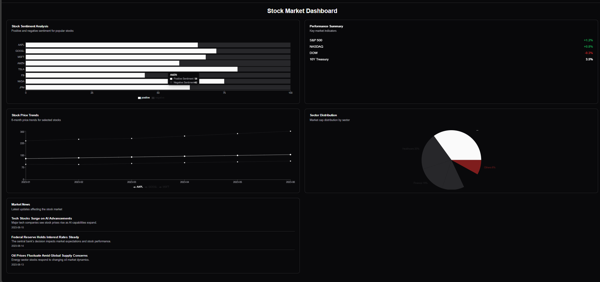
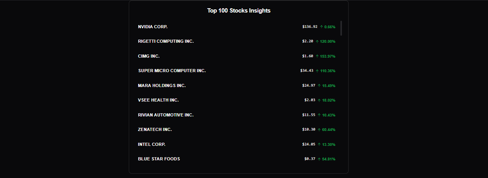

# FINSIGHT

**FINSIGHT** is a predictive analytics tool built with Scikit-Learn, Keras, and Streamlit. Leveraging Long Short-Term Memory (LSTM) networks, it analyzes historical stock market data and generates actionable forecasts for price movements.

---

## 🚀 Features

- Utilizes **LSTM neural networks** to learn temporal patterns in financial data.
- Built with **Scikit-Learn** for preprocessing and **Keras** for model training.
- Includes **Streamlit-based visualizations** for interactive exploration and real-time insight.
- Aims to improve **prediction accuracy**, empowering users to make smarter decisions in volatile markets.
- Simplifies model deployment using **app.py** as the entry point.

---

## 📂 Repository Structure

- `LSTMmodel.ipynb` — Jupyter notebook illustrating EDA, data processing, model architecture, and training workflow.
- `keras_model.h5` — Serialized LSTM model ready for inference.
- `app.py` — Streamlit application to visualize predictions and host the user interface.
- `README.md` — This documentation file (to be improved with more specifics).

---

## 🛠 Getting Started

### 1️⃣ Clone the repository
```bash
git clone https://github.com/Nistha27/FINSIGHT.git
cd FINSIGHT
```
### 2️⃣ Install dependencies
```bash
python3 -m venv venv
# macOS / Linux
source venv/bin/activate
# Windows (PowerShell)
.\venv\Scripts\Activate.ps1

pip install --upgrade pip
pip install -r requirements.txt

```
require.emts.txt
* pandas>=1.3
* numpy>=1.21
* scikit-learn>=1.0
* matplotlib>=3.4
* streamlit>=1.10
* tensorflow>=2.9
* yfinance>=0.1.70
* joblib>=1.0
* scipy>=1.7
* jupyterlab
---

## 📸 Screenshots

Below are some previews of the **FINSIGHT** frontend built with Streamlit.

### Home Page Dasboard


### Insight Page


---

